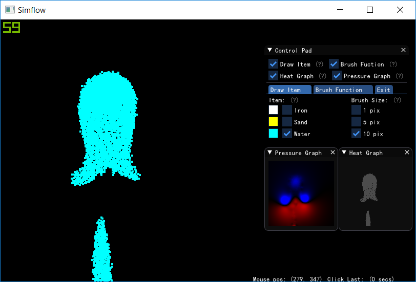
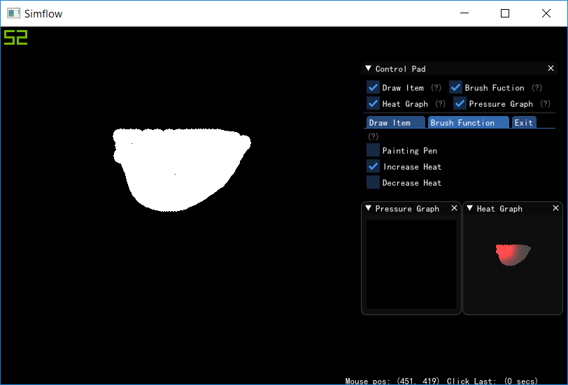

作者：钟嘉农

时间：2019/8/22

## 个人报告

我作为本次项目的组长，搭建了本次项目的基础设施，并统筹了组员的工作。

## 分工任务

在第一轮迭代之前，我搭建了本次项目的基础设施，包括MVVM框架需要使用的消息（通知）类、Github上的Travis-CI持续集成等。

第一轮迭代中，我设计实现了适合于处理大量粒子的算法，为我们的项目提供了实时性。

第二轮迭代中，我尝试实现了若干种流体模拟的算法，并将其集成到我们的项目中，实现了流体与大气、固体之间的耦合（交互）。

第三轮迭代中，我实现了一些数据的可视化（压强、温度），将其绘制成图，集成到了窗口中。

## 具体设计思路

### 消息（通知）

View、ViewModel、Model层的解耦依赖于一个消息传递机制。我参考C#中的事件，实现了本项目中的消息机制——消息发出方提供一个事件源，消息接收方提供一个处理程序，即可完成双方的解耦（即对对方的存在不知情）。

另外，我利用了可变模板参数，实现了事件参数（或者说消息内容）的显式化，允许编译器在编译期间检查事件源、处理程序的类型是否匹配，比起std::any<T>类型的参数，能让人更早地发现错误。

### 粒子处理

我们的项目能实时地（60FPS）处理1.5万个左右的粒子，考虑到每个粒子都要与周围粒子进行碰撞、传热，也要与空气发生交互，因此这个数量是比较可观的。我们使用了一些优化手段，大大加速了运算速度，主要是：

- 网格索引、粒子有序存储
  
  我们在处理一个粒子时，会大量地查询其附近的例子（碰撞检测、传热），因此一个网格索引是必须的，用于快速查询某个区域中有哪些例子。
  
  有一个值得注意的点是，一个区域的全部粒子是一个集合，如果直接存储这个集合（比如使用vector），会带来大量的动态内存分配（来自于集合扩容）。因此，在每一帧，我们对粒子按位置进行排序，这样对每个区域，其包含的粒子的下标必然是连续的，只需要存储粒子下标的区间即可，减少空间占用。

  同时，空间位置靠近的粒子，它们的存储位置也是靠近的，这提高了数据局部性，增加了内存访问速度。

- 粒子数据列式存储

  在某个计算过程中，粒子的某个属性会被特别密集地使用。比如计算传热时，粒子的温度数据会被密集使用。因此，我们对粒子的各个属性进行了分列处理，这虽然增加了编程上的复杂性，但提高了数据局部性，增加了内存访问速度。

### 液体模拟

虽然液体与气体一样同为流体，同样需要解NS方程，但在我们的项目中，液体是用粒子表示的，因此其模拟会有所不同。

一开始，我实现了图形学界比较流行的SPH方法，虽然成功模拟了液体，但是它需要的迭代时间步dt很小，整合入我们的项目后效果不尽如人意。

因此，我换用了一种更简单的模拟方法，仅根据距离计算液体粒子之间的排斥力。虽然模拟出来的液体不具有物理正确性（比如，无法产生连通器的现象），但在实时性上得到了保障。效果如图。

另外，由于我们采用了Leapfrog的迭代方式，且一帧的时间步比较大，容易产生数值爆炸的现象。因此我们对一帧的时间进行了剖分，在一帧内进行若干次时间步更小的Leapfrog迭代，获得了更好的数值稳定性。然而，这样的做法开销比较大，可以考虑使用更高阶的迭代方法（比如RK4等）来提高迭代效果，这是一个可以改进的点。

### 数据可视化

为了便于观察气压、温度，我于View中绘制了气压图、温度图。效果如图（注意右下方）。

- 气压图，红色为正压区，蓝色为负压区。大堆下落粒子的下方，空气受挤压，呈正压（红色）；而下落粒子带动空气流动，在两侧形成环流，环流中心呈负压（蓝色）。这是解算NS方程的结果。
  
  

- 温度图，红色为高温，蓝色为低温。我们加热了这块固体的左上角，此时温度正在向其他部分传播，呈现出了温度梯度。这是解算温度方程的结果。

  

## 心得体会

在本次课程中，我熟悉了C++下的MVVM架构，熟悉了比较现代的团队协作方式（比如持续集成等）。通过MVVM的解耦，项目开发中的沟通成本被降低了；成员之间不再需要频繁地沟通调用方式，只需要在开始时约定接口即可，职责划分很清晰。

## 改进意见

C++的工程管理是一个很有意义的话题，但是个人觉得，比起UI下的设计模式（MVVM），还有更值得探讨的话题。（UI毕竟只是计算机世界的一角，对于学生来说需求可能不是很广泛）

如果课程中能够讲解C++工程中（不仅限于UI）的一些组织、协作、解耦手段，特别是结合一些知名、大型开源C++项目作为例子讲解（比如Chromium、LLVM等），图景会更为广阔，学生的收获会更大。
